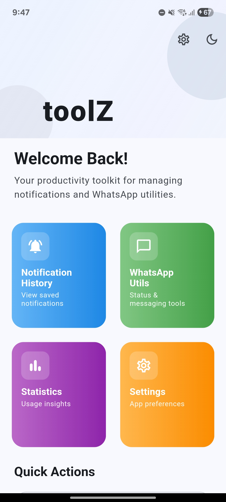
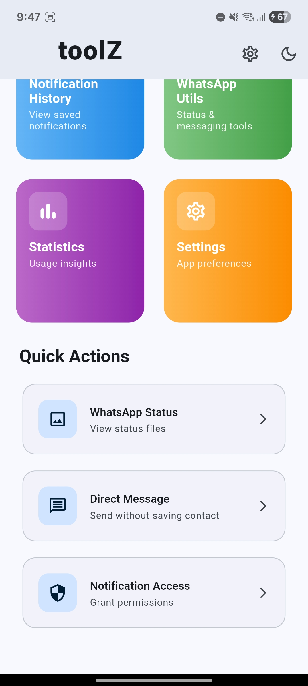
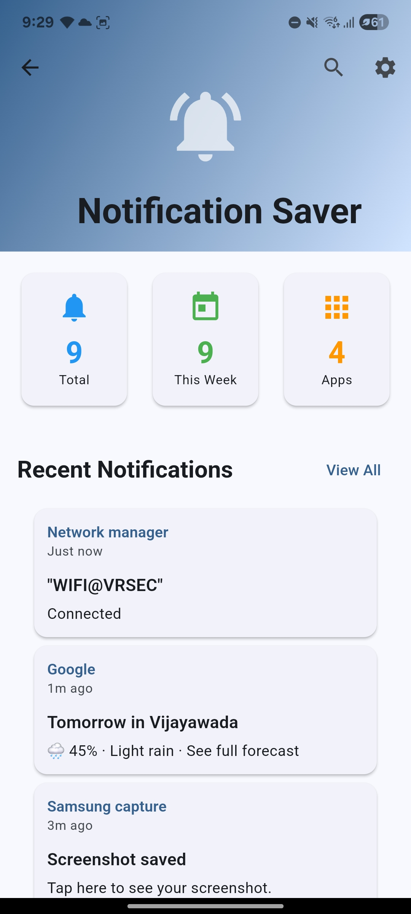
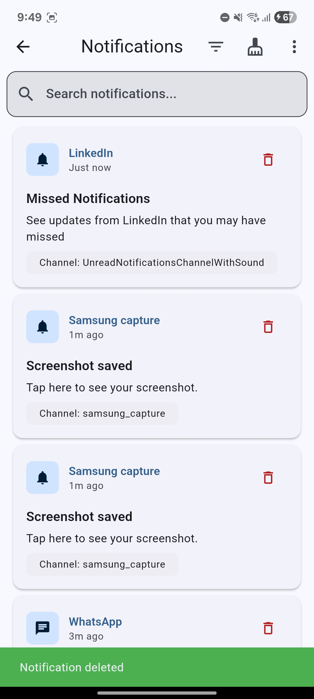
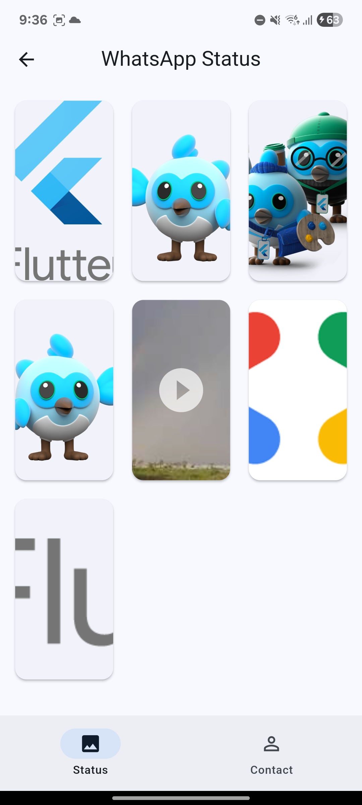
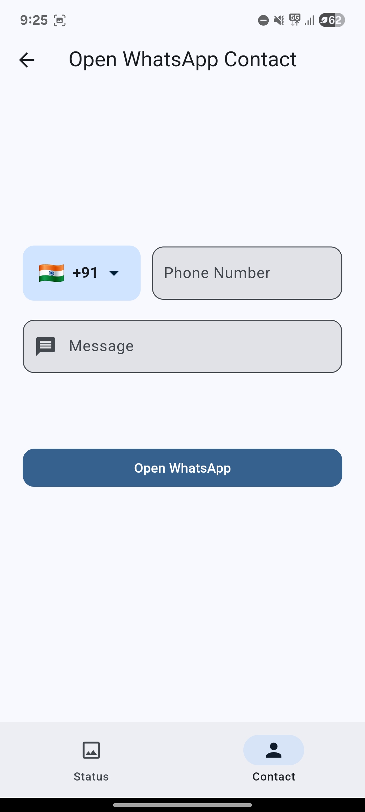
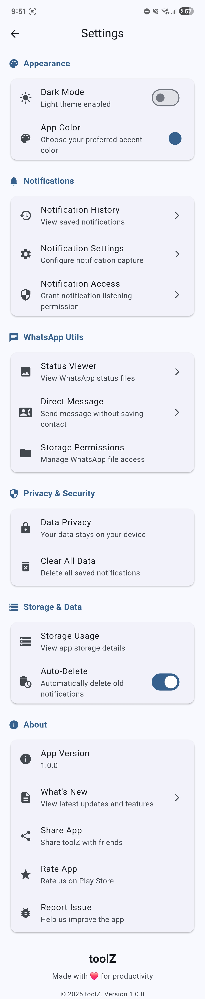
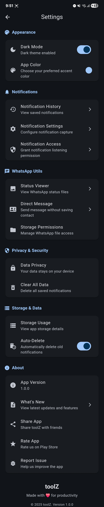

# toolZ ⚡


**toolZ** is a modern Flutter app that enhances your Android experience with  
• notification history & analytics  
• WhatsApp status utilities  
• Material 3 theming with dynamic colors  
All data is stored **locally** in an optimized SQLite database—no tracking, no servers.

---

## ✨ Features

### 📱 Notification Management
- **Complete history** – capture every posted notification
- **Fast search & filters** – by keyword, app, or priority
- **Statistics dashboard** – charts of counts, apps, and time-of-day trends
- **Bulk actions** – delete, auto-cleanup, or export selections

### 💬 WhatsApp Utilities
- **Status viewer** – browse & save friends’ statuses (images/videos)
- **Direct messaging** – send WhatsApp messages without saving contacts

### 🎨 Modern Design
- Material 3 with light/dark & custom accent colors
- Smooth page transitions and responsive layouts

### 🔒 Privacy First
- All data stays on your device
- No analytics, ads, or remote logging

---

## 📸 Screenshots

Add PNG/JPG files to `/screenshots` and change the filenames below.  
Markdown will render them in a nice grid:

<div align="center">


</div>

<div align="center">


</div>

<div align="center">


</div>

<div align="center">


</div>

---

## 🚀 Getting Started

### Prerequisites
- Flutter 3.5 + (stable channel)
- Android SDK 21 + and an emulator or device

### Installation

```
git clone https://github.com/saisurendra6/toolz.git
cd toolz
flutter pub get
flutter run    # plug in a device or start an emulator first
```

---

## 🔑 Required Permissions

| Purpose               | Permission flow                                                                 |
|-----------------------|---------------------------------------------------------------------------------|
| Notification capture  | App prompts → opens **Notification Access** settings → toggle **toolZ** on      |
| WhatsApp status media | Storage / Media access prompt on first use of Status Viewer                     |

---

## 🏗️ Project Structure

```
lib/
 ├─ core/           # constants, services, utils
 ├─ providers/      # state management (Provider)
 ├─ models/         # data classes
 └─ presentation/   # screens & widgets

android/
 └─ app/src/main/java/com/example/toolz/
      ├─ Notifications/
      │    ├─ database/   # NotificationDatabaseHelper.java
      │    └─ service/    # MyNotificationListener.java
      └─ MainActivity.java
```

---

## ⚙️ Architecture

| Layer          | Technology / Key files                                  |
|----------------|---------------------------------------------------------|
| UI             | Flutter, Material 3 (`presentation/`)                   |
| State          | Provider (`providers/`)                                 |
| Native bridge  | MethodChannel (`MainActivity.java`, `lib/core/services`)|
| Capture layer  | `MyNotificationListener` (Android NotificationListenerService) |
| Storage        | `NotificationDatabaseHelper` (SQLite WAL, prepared SQL) |

---

## 🛠️ Development Tips
1. Run `flutter doctor` to verify SDK setup.
2. `WidgetsFlutterBinding.ensureInitialized()` must be called in `main.dart` before any MethodChannel use.
3. Test database operations with `adb shell` → `sqlite3 /data/data/<package>/databases/notifications.db`.

---

## 📦 Building for Release

```
# APK
flutter build apk --release
# Play Store bundle
flutter build appbundle --release
```

---

## 🤝 Contributing

1. Fork the repo and create your branch: `git checkout -b feature/YourFeature`
2. Commit changes: `git commit -m "Add YourFeature"`
3. Push to the branch: `git push origin feature/YourFeature`
4. Open a Pull Request 🎉

---

## 📝 License


---

<div align="center">
Made with ❤️ & Flutter for productivity.  
⭐ Star this repo if it helps you!
</div>
